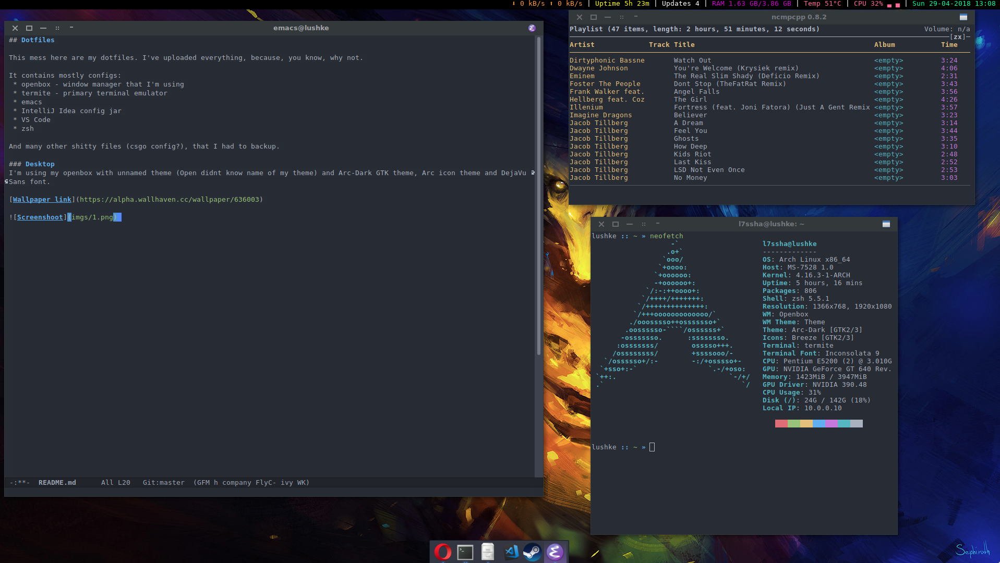

## Dotfiles

This mess here are my dotfiles. I've uploaded everything, because, you know, why not.

It contains mostly configs:

 * openbox - window manager that I'm using
 * termite - primary terminal emulator
 * emacs
 * IntelliJ Idea config jar
 * VS Code
 * zsh
 * Rider, Resharper
 * my custom scripts
 
And many other shitty files (csgo config?), that I had to backup.

### Desktop

 * Wallpaper: [https://alpha.wallhaven.cc/wallpaper/636003](https://alpha.wallhaven.cc/wallpaper/636003)
 * GTK theme: Arc Dark
 * Icons: Breeze
 * System font: DejaVu Sans
 * Console font: Inconsolata
 * Window Manager: Openbox
 * Statusbar: Polybar
 * Dock: Plank
 * Shell: zsh
 * Terminal: termite

